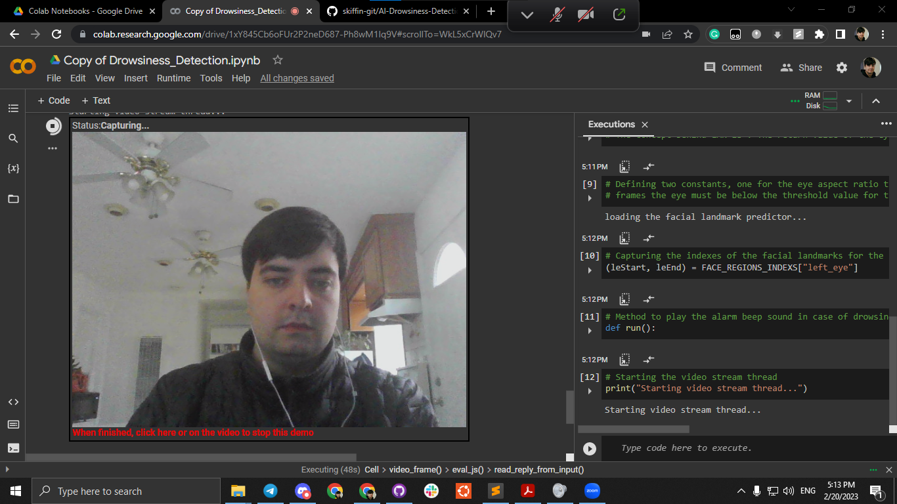
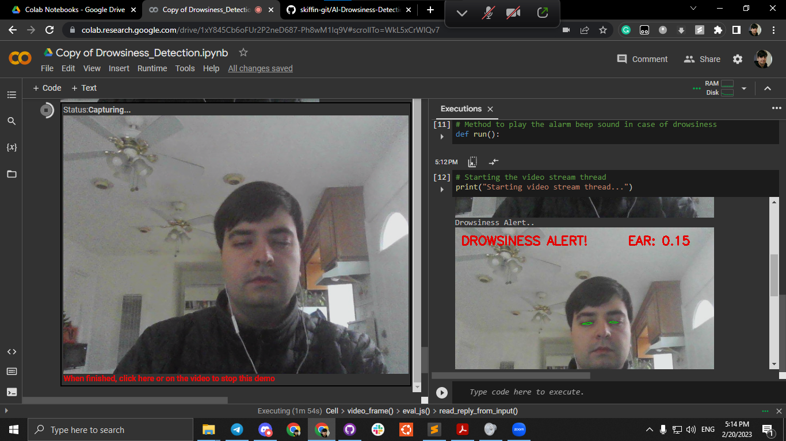
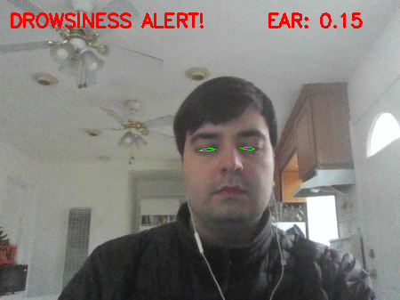

# AI Drowsiness Detection Application

## Languages | Frameworks | Tools

* Python - used as a Web programming language
* DLib - for face region predictor
* Colab - to write, execute and visualize the project
* Jupiter

## Screenshots of Program Running

## About DLib

* DLib is a C++ based open source library that is used for a wide range of tasks such as face detection, face landmark detection, face recognition, object detection, and more.

* One of the key features of DLib is its ability to map human faces by detecting key points or landmarks on the face, such as the eyes, nose, and mouth. This is achieved using machine learning and deep neural networks.

* Face detection and tracking features are also highly accurate and robust, and can handle various lighting conditions, face orientations, and occlusions.

* DLib is cross-platform and can be used on various operating systems including Windows, macOS, and Linux. It is also licensed under the Boost Software License, which means it can be used for both open source and commercial applications. 

* DLib has been used in various applications such as autonomous vehicles, security systems, and medical imaging, among others.

## Face Detection

* HOG + SVM gathered a good amount of Convolutional Neutral Network and based face detector is available in DLib. Detector is based on histogram of oriented gradients (HOG) and liniar SVM.

* It is capble of detecting faces almost in all angles.

* Donsiede: it is not suitable for real time video. It is meant to be executed on GPU. To get good speed, you might need to run with powerful Nvidia GPU.

## Face Region Prediction

* Dlib can incredibly find 68 different facial landmarks points.

* Facial Landmarks are used to localize and represent important regions of face, such as: Moith, Eyes and Eyebows.

# Steps to run the project

1. Create gdrive dedicated folder for project
2. Copy project files from my gdrive to yours: 
https://drive.google.com/drive/folders/1PUwV1O95wox4DGVg4exT01PIVtWLwjL7?usp=sharing
4. Make sure that path is correct: 
/MyDrive/Colab Notebooks/Drowsiness_Detection/
5. Before running the project, should run next command in linux based console:
 FOR FRESH BUILD:
 install dlib (will take 10 or more minutes)
 !apt update
 !apt install -y cmake
 !pip install dlib
6. Make sure that you have connected to computer or use laptop camera
7. Camera should not be used by other devices
8. In runtime use Run  all
9. Connect to your gdrive
* If need to restart, use Restart and run all

